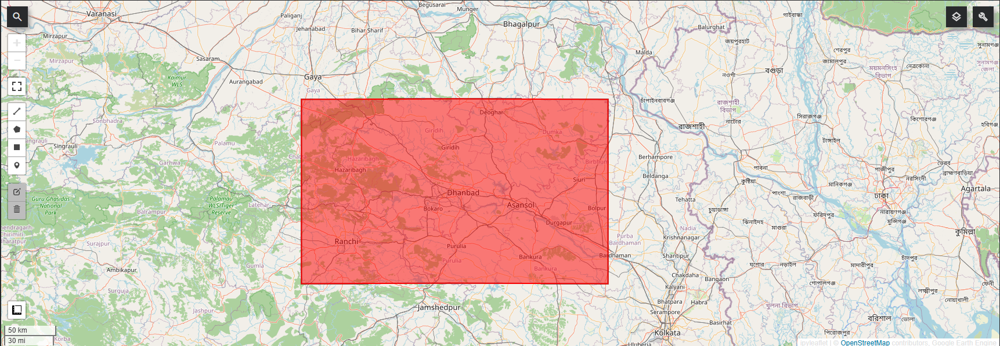
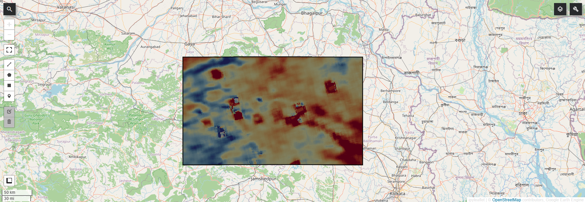
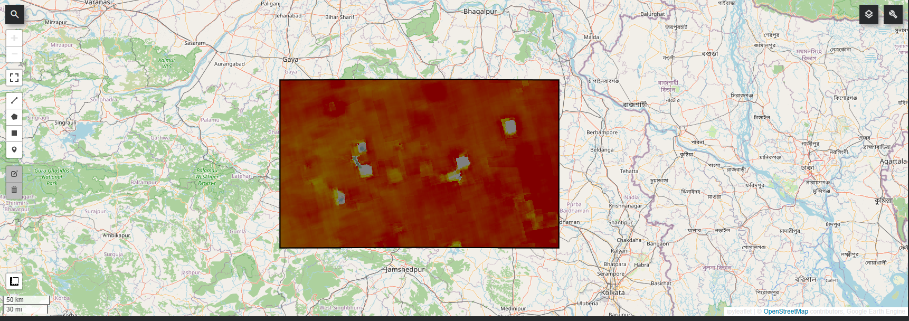
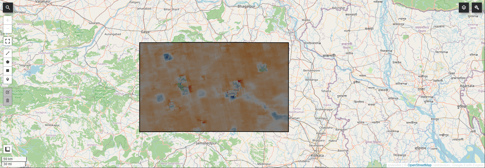
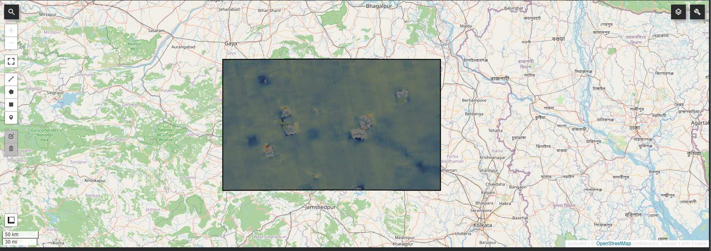
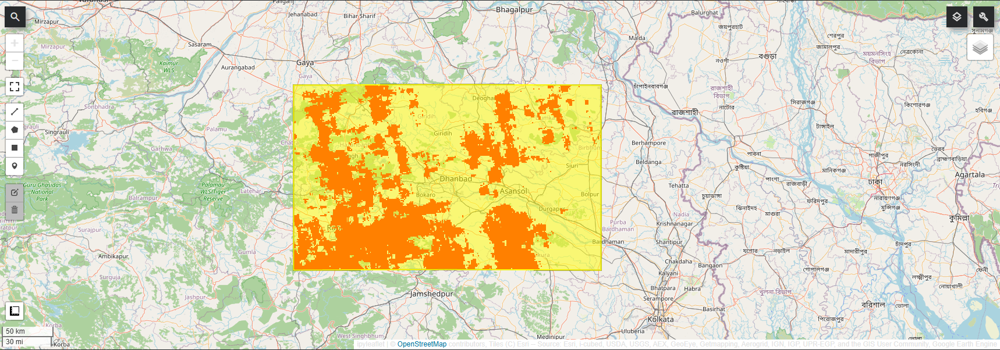
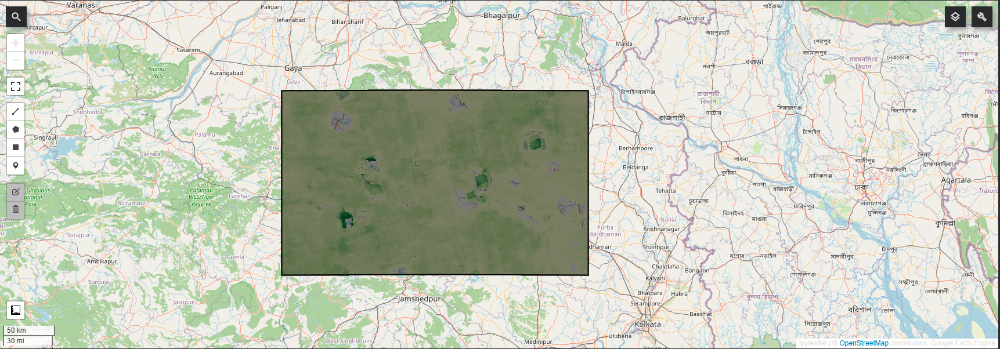
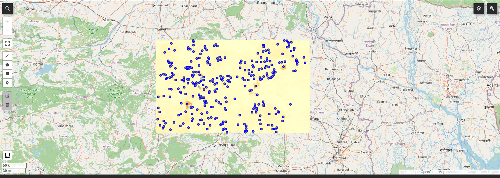
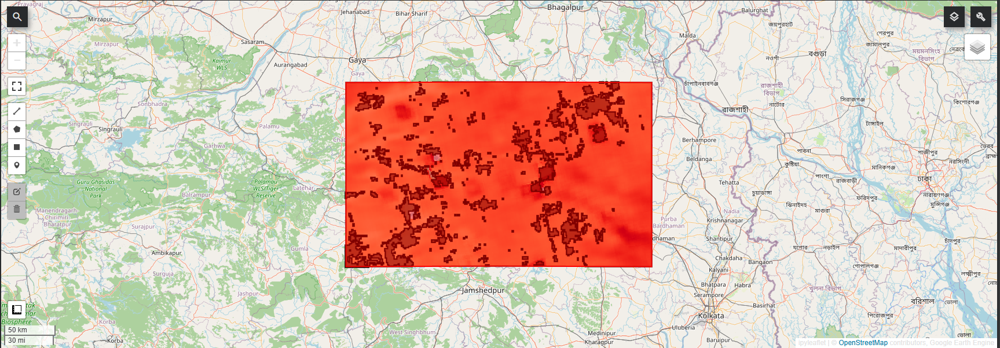
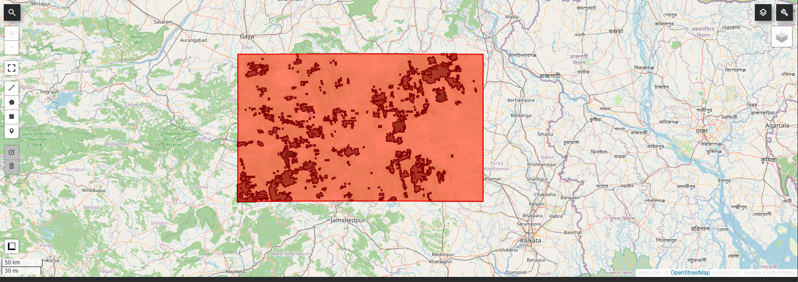

# Satellite-Based Methane Hotspot Detection over the Damodar Valley Coal Belt using Sentinel-5P TROPOMI, Google Earth Engine and Python

A cloud-based remote sensing workflow for detecting persistent atmospheric methane hotspots over the Damodar Valley Coal Belt using Sentinel-5P TROPOMI observations, Google Earth Engine, Geemap and Python.

The project combines historical baseline modelling, statistical anomaly detection, Z-score analysis, hotspot persistence mapping and interactive geospatial visualization to identify recurring methane enhancement zones associated with one of India's largest coal mining regions.


---

# Table of Contents

- Project Overview
- Key Features
- Objectives
- Study Area
- Dataset
- Technologies Used
- Project Structure
- Results
- Workflow
- Figures
- Interactive Map
- Installation
- Applications
- Future Improvements
- Author
- License

# Project Overview

Methane (CH₄) is one of the most significant greenhouse gases contributing to climate change. This project develops a cloud-based workflow using Sentinel-5P TROPOMI observations and Google Earth Engine to identify statistically significant methane anomalies across the Damodar Valley Coal Belt. Historical methane observations are used to establish a baseline, monthly anomalies are converted to Z-scores, and persistent hotspot regions are extracted for interactive visualization and GIS analysis.

---

# Key Features

- Google Earth Engine cloud processing
- Sentinel-5P TROPOMI methane observations
- Historical methane baseline modelling
- Monthly anomaly detection
- Z-score based hotspot detection
- Persistent hotspot frequency analysis
- Vector polygon extraction
- Hotspot centroid extraction
- Interactive web map
- Python + Geemap implementation

---

# Objectives

- Detect atmospheric methane anomalies.
- Develop a historical methane baseline.
- Calculate methane anomalies and Z-scores.
- Detect statistically significant hotspot pixels.
- Identify persistent methane hotspots.
- Export hotspot polygons and centroids.
- Build an interactive web map.

---

# Study Area

The study focuses on the **Damodar Valley Coal Belt**, extending across **Jharkhand** and **West Bengal**.

Major districts:

- Dhanbad
- Bokaro
- Giridih
- Asansol
- Raniganj

| Longitude | Latitude |
|-----------|----------|
|84.0° E|23.0° N|
|88.5° E|24.8° N|

---

# Dataset

| Dataset | Source |
|---------|--------|
| Sentinel-5P TROPOMI Methane | Copernicus Programme |
| Platform | Google Earth Engine |
| Temporal Coverage | January 2019 – December 2025 |
| Spatial Resolution | ~7 km |
| Variable | CH₄ Column Volume Mixing Ratio (Dry Air) |

---

# Technologies Used

- Python
- Google Earth Engine
- Geemap
- Sentinel-5P TROPOMI
- NumPy
- Pandas
- Jupyter Notebook

---

# Project Structure

```text
METHANE-HOTSPOT-MAPPER
│
├── Damodar_Valley_Methane_Hotspot_Detection.ipynb
├── Methane_Hotspot_Mapper.py
├── README.md
├── requirements.txt
├── LICENSE
├── METHANE_HOTSPOT_MAPPER.html
├── 01_STUDY_AREA.png
├── 02_HISTORICAL_MEAN_METHANE_CONCENTRATION.png
├── 03_HISTORICAL_METHANE_VARIABILITY.png
├── 04_MONTHLY_METHANE_ANOMALY.png
├── 05_MONTHLY_METHANE_ZSCORE.png
├── 06_MONTHLY_METHANE_HOTSPOTS.png
├── 07_PERSISTENT_HOTSPOT_FREQUENCY.png
├── 08_HOTSPOT_CENTROIDS.png
├── 09_INTERACTIVE_BASELINE_MAP.png
└── 10_INTERACTIVE_PERSISTENT_HOTSPOT_MAP.png
```

---

# Results

Major outputs include:

- Historical methane baseline
- Historical methane variability
- Monthly methane anomaly
- Monthly methane Z-score
- Monthly hotspot detection
- Persistent hotspot frequency
- Persistent hotspot polygons
- Hotspot centroid extraction
- Interactive HTML map integrating all analysis layers

---

# Workflow

```text
Sentinel-5P TROPOMI
        │
        ▼
Google Earth Engine
        │
        ▼
Area of Interest Selection
        │
        ▼
Historical Baseline
        │
        ▼
Historical Standard Deviation
        │
        ▼
Monthly Composite
        │
        ▼
Methane Anomaly
        │
        ▼
Z-Score Analysis
        │
        ▼
Hotspot Detection
        │
        ▼
Persistence Analysis
        │
        ▼
Vector Extraction
        │
        ▼
Hotspot Centroids
        │
        ▼
Interactive HTML Map
```

---

# Figures

## FIGURE 1. STUDY AREA



## FIGURE 2. HISTORICAL MEAN METHANE CONCENTRATION



## FIGURE 3. HISTORICAL METHANE VARIABILITY



## FIGURE 4. MONTHLY METHANE ANOMALY



## FIGURE 5. MONTHLY METHANE Z-SCORE



## FIGURE 6. MONTHLY METHANE HOTSPOTS



## FIGURE 7. PERSISTENT HOTSPOT FREQUENCY



## FIGURE 8. HOTSPOT CENTROIDS



## FIGURE 9. INTERACTIVE BASELINE MAP



## FIGURE 10. INTERACTIVE PERSISTENT HOTSPOT MAP



---

# Interactive Map

The repository includes a single interactive HTML map:

**`METHANE_HOTSPOT_MAPPER.html`**

Layers included:

- Study Area
- Historical Mean Methane
- Historical Methane Variability
- Monthly Methane Anomaly
- Monthly Methane Z-Score
- Monthly Methane Hotspots
- Persistent Hotspot Frequency
- Persistent Hotspot Polygons
- Hotspot Centroids

Open the HTML file in any modern web browser to explore the interactive map.

---

# Installation

```bash
git clone https://github.com/dibyajotidas611/METHANE-HOTSPOT-MAPPER.git
```

```bash
pip install earthengine-api geemap pandas numpy matplotlib
```

```python
import ee
ee.Authenticate()
ee.Initialize(project="methane-hotspot-detection")
```

Run:

- `Damodar_Valley_Methane_Hotspot_Detection.ipynb`
- `Methane_Hotspot_Mapper.py`

Interactive visualization:

- `METHANE_HOTSPOT_MAPPER.html`

---

# Applications

- Methane emission monitoring
- Coal mining environmental assessment
- Greenhouse gas surveillance
- Climate change studies
- Remote sensing research
- GIS-based spatial analysis
- Earth observation

---

# Future Improvements

- Near real-time methane monitoring
- Machine learning hotspot classification
- WebGIS dashboard
- Sentinel-2 integration
- Automated reporting
- Emission estimation

---

# Author

## Dibya Jyoti Das

Master's in Applied Geology

Remote Sensing • GIS • Google Earth Engine • Python

If you found this project useful, consider giving this repository a ⭐.

---

# License

This project is released under the MIT License.
